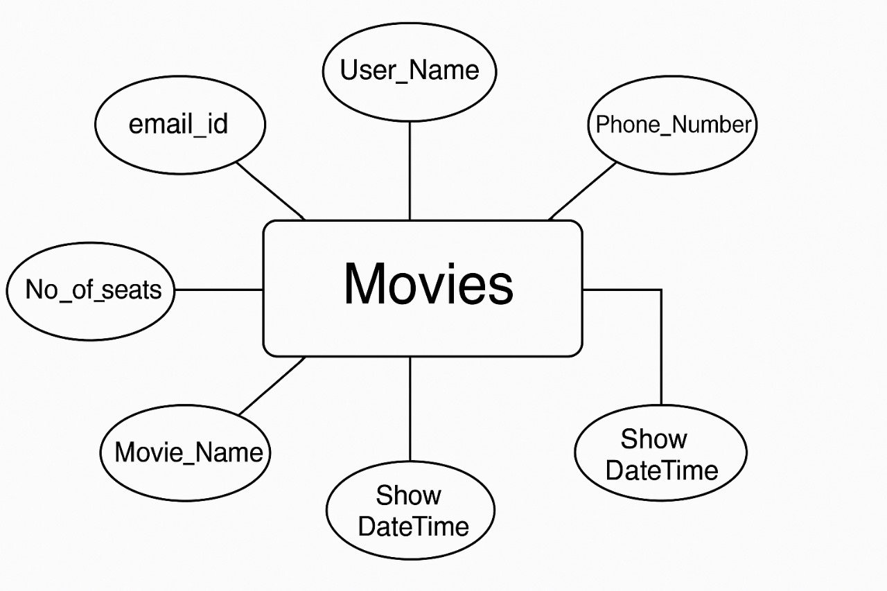

# Ex02 Django ORM Web Application
## Date: 24.04.2025

## AIM
To develop a Django application to store and retrieve data from a Movies Database using Object Relational Mapping(ORM).

## ENTITY RELATIONSHIP DIAGRAM



## DESIGN STEPS

### STEP 1:
Clone the problem from GitHub

### STEP 2:
Create a new app in Django project

### STEP 3:
Enter the code for admin.py and models.py

### STEP 4:
Execute Django admin and create details for 10 books

## PROGRAM
```
admin.py

from django.contrib import admin
from .models import Movies,MoviesAdmin

admin.site.register(Movies, MoviesAdmin)

models.py

from django.db import models
from django.contrib import admin
class Movies(models.Model):
    User_id = models.CharField(max_length=20, help_text="User ID")
    User_Name = models.CharField(max_length=100)
    email_id = models.EmailField()
    No_of_seats = models.IntegerField()
    Movie_Name=models.CharField(max_length=20)
    Show_DateTime=models.DateTimeField()
    Phone_Number=models.CharField(max_length=10, help_text="Phone number")
class MoviesAdmin(admin.ModelAdmin):
    list_display = ('User_id', 'User_Name', 'email_id', 'No_of_seats', 'Movie_Name','Show_DateTime','Phone_Number')
```


## OUTPUT


## RESULT
Thus the program for creating movies database using ORM hass been executed successfully
